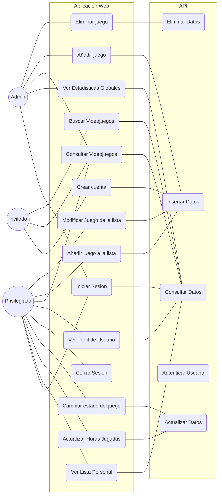

```mermaid
flowchart LR
    Invitado((Invitado))    
    Privilegiado((Privilegiado))
    Admin((Admin))

    subgraph App [Aplicacion Web]
        aCU1(Iniciar Sesion)
        aCU2(Crear cuenta)
        aCU3(Consultar Videojuegos)
        aCU4(Añadir juego a la lista)
        aCU5(Modificar Juego de la lista)
        aCU6(Añadir juego)
        aCU7(Eliminar juego)
        aCU8(Buscar Videojuegos)
        aCU9(Ver Lista Personal)
        aCU10(Actualizar Horas Jugadas)
        aCU11(Cambiar estado del juego)
        aCU12(Cerrar Sesion)
        aCU13(Ver Perfil de Usuario)
        aCU14(Ver Estadisticas Globales)
    end

    subgraph Api [API]
        bCU1(Consultar Datos)
        bCU2(Insertar Datos)
        bCU3(Eliminar Datos)
        bCU4(Actualizar Datos)
        bCU5(Autenticar Usuario)
    end

    Invitado --- aCU2
    Privilegiado --- aCU1
    Admin --- aCU1
    Invitado --- aCU3
    Invitado --- aCU8
    Privilegiado --- aCU9
    Privilegiado --- aCU10
    Privilegiado --- aCU11
    Privilegiado --- aCU12
    Privilegiado --- aCU13
    Admin --- aCU14
    Privilegiado --- aCU3
    Privilegiado --- aCU4
    Privilegiado --- aCU5
    Admin --- aCU3
    Admin --- aCU6
    Admin --- aCU7

    aCU3 --- bCU1
    aCU2 --- bCU2
    aCU1 --- bCU1
    aCU4 --- bCU2
    aCU5 --- bCU2
    aCU6 --- bCU2
    aCU7 --- bCU3
    aCU8 --- bCU1
    aCU9 --- bCU1
    aCU10 --- bCU4
    aCU11 --- bCU4
    aCU12 --- bCU5
    aCU13 --- bCU1
    aCU14 --- bCU1

```