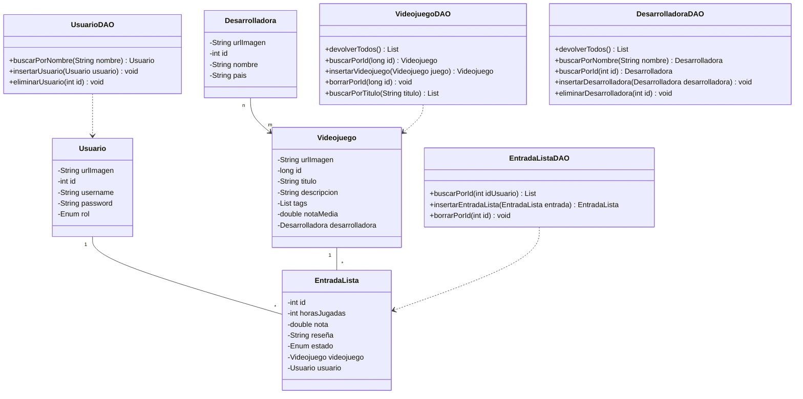

```mermaid
classDiagram
    %% Entidades (Modelos)
    class Usuario {
        -String urlImagen
        -int id
        -String username
        -String password
        -Enum rol
    }

    class Videojuego {
        -String urlImagen
        -long id
        -String titulo
        -String descripcion
        -List<String> tags
        -double notaMedia
        -Desarrolladora desarrolladora
    }

    class EntradaLista {
        -int id
        -int horasJugadas
        -double nota
        -String reseña
        -Enum estado
        -Videojuego videojuego
        -Usuario usuario
    }

    class Desarrolladora {
        -String urlImagen
        -int id
        -String nombre
        -String pais
    }

    %% DAOs (Repositorios de Spring Boot)
    class VideojuegoDAO {
        +devolverTodos() List<Videojuego>
        +buscarPorId(long id) Videojuego
        +insertarVideojuego(Videojuego juego) Videojuego
        +borrarPorId(long id) void
        +buscarPorTitulo(String titulo) List<Videojuego>
    }

    class UsuarioDAO {
        +buscarPorNombre(String nombre) Usuario
        +insertarUsuario(Usuario usuario) void
        +eliminarUsuario(int id) void
    }

    class EntradaListaDAO {
        +buscarPorId(int idUsuario) List<EntradaLista>
        +insertarEntradaLista(EntradaLista entrada) EntradaLista
        +borrarPorId(int id) void
    }

    class DesarrolladoraDAO {
        +devolverTodos() List<Desarrolladora>
        +buscarPorNombre(String nombre) Desarrolladora
        +buscarPorId(int id) Desarrolladora
        +insertarDesarrolladora(Desarrolladora desarrolladora) void
        +eliminarDesarrolladora(int id) void
    }

    %% Relaciones entre Entidades
    Usuario "1" -- "*" EntradaLista
    Videojuego "1" -- "*" EntradaLista
    Desarrolladora "n" --> "m" Videojuego

    %% Relaciones de Dependencia (DAOs manejan Entidades)
    VideojuegoDAO ..> Videojuego
    UsuarioDAO ..> Usuario
    EntradaListaDAO ..> EntradaLista


```