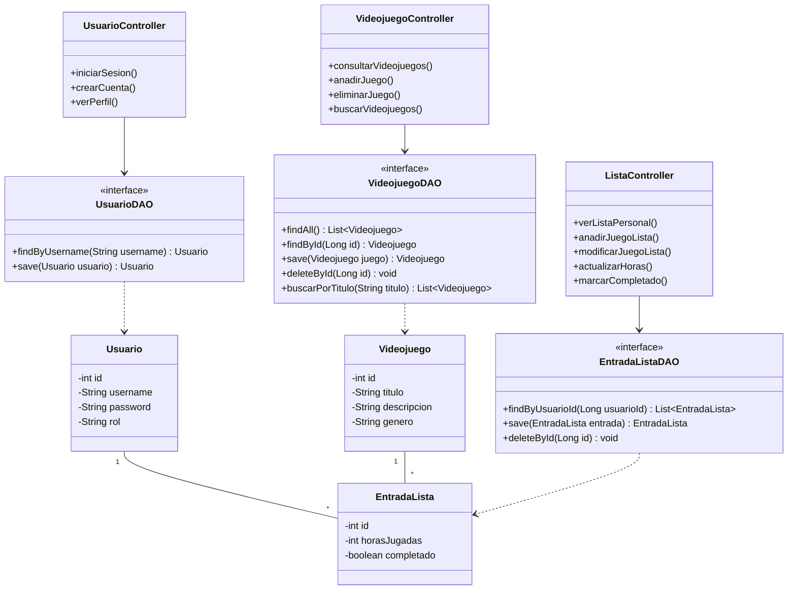

```mermaid
classDiagram
    %% Entidades (Modelos)
    class Usuario {
        -int id
        -String username
        -String password
        -String rol
    }

    class Videojuego {
        -int id
        -String titulo
        -String descripcion
        -String genero
    }

    class EntradaLista {
        -int id
        -int horasJugadas
        -boolean completado
    }

    %% DAOs (Repositorios de Spring Boot)
    class VideojuegoDAO {
        <<interface>>
        +findAll() List~Videojuego~
        +findById(Long id) Videojuego
        +save(Videojuego juego) Videojuego
        +deleteById(Long id) void
        +buscarPorTitulo(String titulo) List~Videojuego~
    }

    class UsuarioDAO {
        <<interface>>
        +findByUsername(String username) Usuario
        +save(Usuario usuario) Usuario
    }

    class EntradaListaDAO {
        <<interface>>
        +findByUsuarioId(Long usuarioId) List~EntradaLista~
        +save(EntradaLista entrada) EntradaLista
        +deleteById(Long id) void
    }

    %% Controladores (API)
    class VideojuegoController {
        +consultarVideojuegos()
        +anadirJuego()
        +eliminarJuego()
        +buscarVideojuegos()
    }

    class UsuarioController {
        +iniciarSesion()
        +crearCuenta()
        +verPerfil()
    }

    class ListaController {
        +verListaPersonal()
        +anadirJuegoLista()
        +modificarJuegoLista()
        +actualizarHoras()
        +marcarCompletado()
    }

    %% Relaciones entre Entidades
    Usuario "1" -- "*" EntradaLista
    Videojuego "1" -- "*" EntradaLista

    %% Relaciones de Dependencia (DAOs manejan Entidades)
    VideojuegoDAO ..> Videojuego
    UsuarioDAO ..> Usuario
    EntradaListaDAO ..> EntradaLista

    %% Relaciones de Controladores con DAOs (Inyección de dependencias)
    VideojuegoController --> VideojuegoDAO
    UsuarioController --> UsuarioDAO
    ListaController --> EntradaListaDAO
```